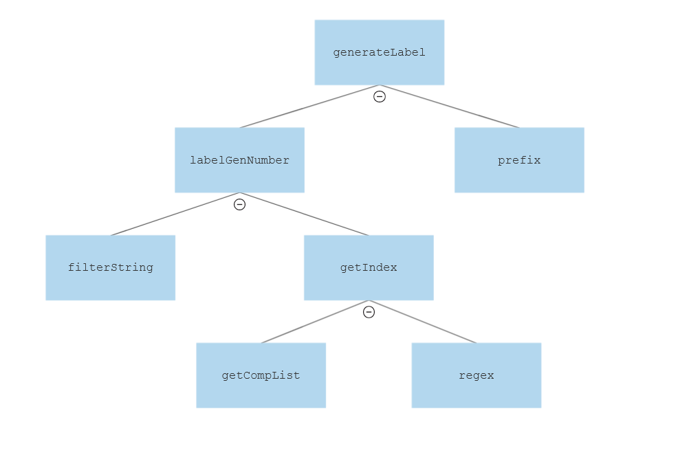

TBL 2 Report
============
Contributors:

Call Tree
---------
Our team started looking through [**Labels.fs**](./Labels/Labels/src/Labels.fs), and built the following function call tree:

We want to count how many components of a given type there are