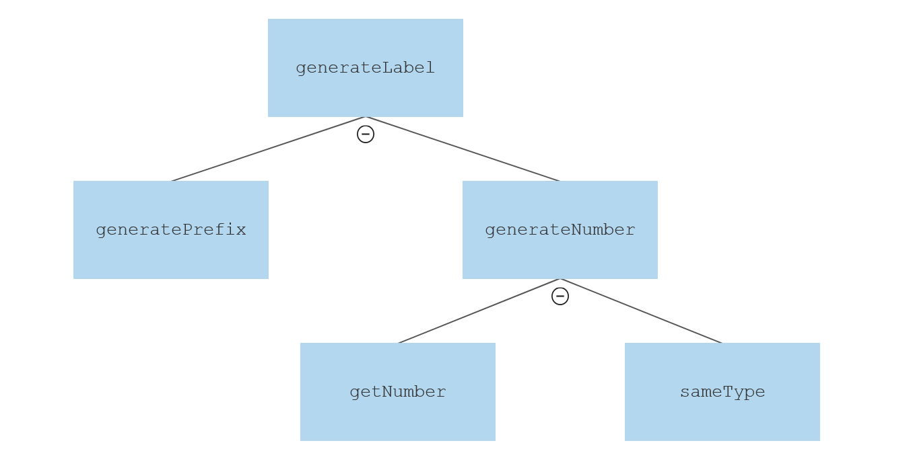

TBL 2 Report
============
Contributors: 
- yz8819
- sts219
- ml3319
- nh1019
- my5918

Call Tree
---------
Our team started looking through [**Labels.fs**](./Labels/Labels/src/Labels.fs), and built the following function call tree:


Refactoring
-----------
These were the following ways we improved the given code:
- filterString function removed, generatePrefix now always returns an uppercase string.

- Renamed functions / variables to make more sense
    - getCompList to filterSymbols
    - getIndex to generateNumber
    - prefix to generatePrefix
    - listSymbols to symbols
    - regex to getNumber

- Added XML comments to functions to give brief descriptions of what they did.

A large goal of this was to make it easy when reading the top level function to see what was being done: generating a label requires:
- A prefix, based on the component type
- A number to serve as the suffix, based on how many instances of a given component exist (with the exception of IO)
This is now clear from reading the `generateLabel` function

We were quite unhappy with the getCompList function (now called filterSymbols). The current algorithm for determining the label number is as follows:
1. Filter symbol list to only get symbols that match the compType we are interested in
2. Get the number of each of the remaining symbols
3. Return the maximum value of these + 1

1. Map each symbol in the list to either:
    - Its label number if it matches the compType
    - Else 0
2. Return the maximum value of these + 1
This operation can be reduced into a single List.fold call.
    
The biggest issue is how to match types cleanly, we essentially want to see if `sym.Compo.Type` matches `compType`, and if it does process it in a certain way, else process it in another way. If this must be hardcoded, seperate this into a new function that can be called inside the new `generateNumber` function. This would allow us to rewrite the generateNumber function as follows:
``` F#
let generateNumber symbols compType =
    let getMaxNumber currMax sym = 
        if sameType compType sym.Compo.Type then
            max currMax (getNumber sym.Compo.Label) 
        else
            currMax
    (0, symbols)
    ||> List.fold getMaxNumber
    |> (+) 1
    |> string
```
Based on the feedback in the final call, creating this `sameType` function to explicitly match the different DU cases and group them when wanted would be the best way to implement this.

All these changes would result in the following, simplified call tree:
